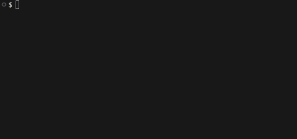

# NPX CARD

This is my personal NPX card, a small terminal experience that lets you connect with me directly from the console.

👇 Just run

```bash
npx viniciuslft
```


And get to know me in a more creative way, right from the terminal.

<hr/>
##### STEPS TO CREATE YOUR OWN

This project was inspired by the article below. I used it as a reference to understand the overall idea of building and publishing a personal terminal card with npm, then adapted it to my own style.

[Write a Simple npx Business Card](https://studioelsa.se/blog/open-source-oss-npx-business-card). 